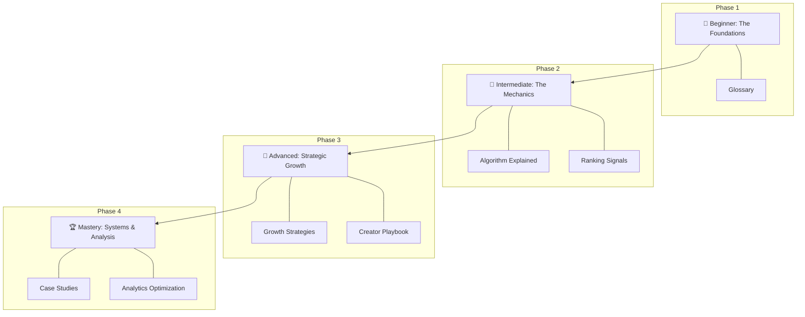
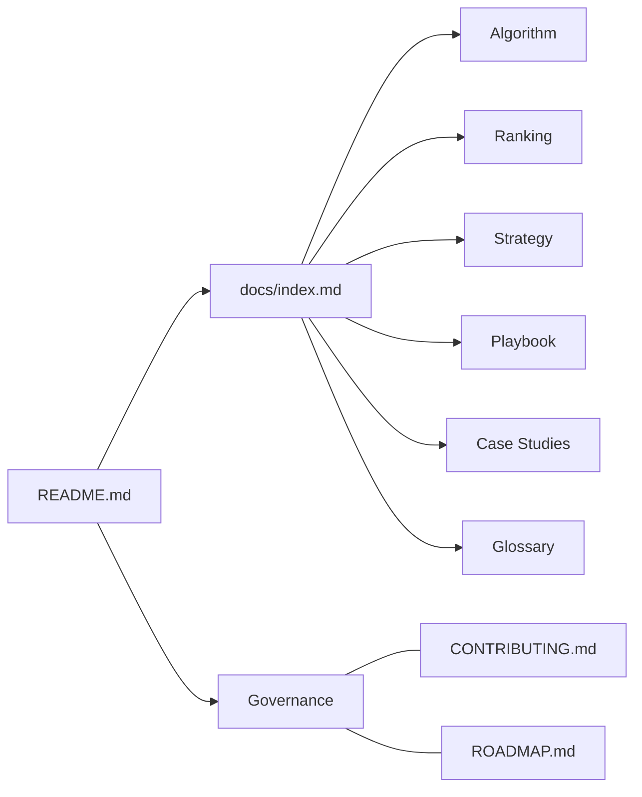

# X Growth Lab 🧪

**The most useful open-source resource for understanding content distribution, recommendation systems, and creator growth on X.**

---

## 🚀 Why This Repository Exists
Most "growth hacks" are temporary, unsupported, or spammy. The platform is not a lottery; it is a complex **Recommendation System**.

X Growth Lab exists to demystify the mechanics of the "For You" feed and provide creators, founders, and developers with a systems-based approach to growth. We bridge the gap between technical platform engineering and practical creator workflows.

## 👥 Who This Is For
- **Beginners:** Learn the "rules of the game" from scratch.
- **Creators:** Transition from "random posting" to a sustainable engine.
- **Founders/Indie Hackers:** Build authority and distribution for your products.
- **Marketers:** Understand the technical ranking signals that drive reach.
- **AI Builders:** Study the large-scale recommendation pipelines that power modern social apps.

## 🗺 Learning Roadmap
Follow this visual progression to master the platform:

## 🧠 Key Concepts Covered
| Concept | Description | Document |
| :--- | :--- | :--- |
| **Heavy Ranker** | The neural network scoring candidate posts. | [Algorithm Explained](docs/algorithm-explained.md) |
| **Signal Weights** | The hierarchy of Bookmarks, Replies, and Likes. | [Ranking Signals](docs/ranking-signals.md) |
| **3-Pillar Strategy** | Balancing Value, Authority, and Personality. | [Growth Strategies](docs/growth-strategies.md) |
| **Daily Workflow** | The "20-5-10-15" routine for consistency. | [Creator Playbook](docs/creator-playbook.md) |
| **Out-of-Network** | How to reach users who don't follow you. | [Glossary](docs/glossary.md) |

## 🏗 Repository Architecture

## 🎯 Example Learning Outcomes
By the end of this curriculum, you will be able to:
1. **Analyze your analytics** to identify high-signal content.
2. **Design hooks** that significantly increase "Out-of-Network" reach.
3. **Build a daily routine** that ensures growth without burnout.
4. **Understand the recommendation pipeline** to optimize for long-term retention.

## ✨ What Makes This Different?
- **Systems Over Hacks:** We don't teach "one weird trick." we teach how the engine works.
- **Educational First:** Every guide includes exercises and "beginner mistakes" to avoid.
- **Open & Evolving:** This isn't a static PDF; it's a living, community-driven project.

## ⏱ Quick Start
1. **Star this repository** to track updates.
2. Visit the **[Learning Hub (docs/index.md)](docs/index.md)**.
3. Start with the **[Algorithm Explained](docs/algorithm-explained.md)** (3 min read).

## 🔮 Future Features Preview
- **Phase 2 (Templates):** Profile optimization checklists and content calendars.
- **Phase 3 (Datasets):** Curated hooks and high-performance post structures.
- **Phase 4 (Tools):** Open-source CLI analytics and engagement trackers.

## 🤝 Contributing
We love contributions! See **[CONTRIBUTING.md](CONTRIBUTING.md)** for our standards and how to get involved.

---

Built with ❤️ by the community.
