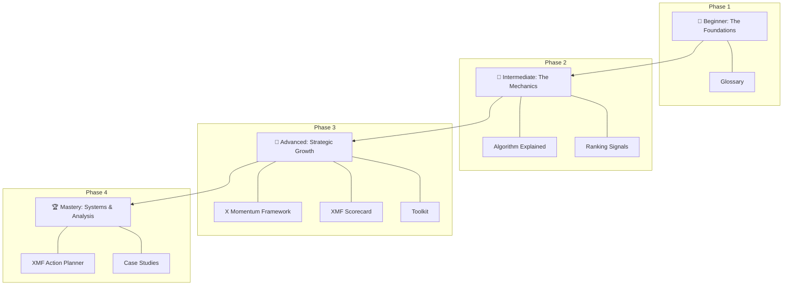
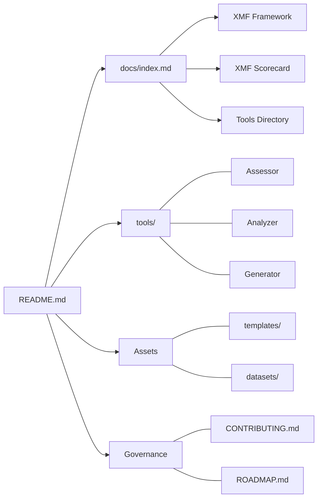

# X Growth Lab 🧪

**The most useful open-source resource for understanding content distribution, recommendation systems, and creator growth on X.**

---

## 🚀 Why This Repository Exists
Most "growth hacks" are temporary, unsupported, or spammy. The platform is not a lottery; it is a complex **Recommendation System**.

X Growth Lab exists to demystify the mechanics of the "For You" feed and provide creators, founders, and developers with a systems-based approach to growth. We bridge the gap between technical platform engineering and practical creator workflows.

## 🛠 The Tooling Layer (New!)
Turn theory into action with our local-first creator toolkit:
- **[X Momentum Assessor](tools/x-momentum-assessor.py):** Audit your account health.
- **[Post Analyzer](tools/post-analyzer.py):** Optimize your drafts before posting.
- **[Hook Generator](tools/hook-generator.py):** Never start from a blank page.
- **[Engagement Score](tools/engagement-score.py):** Estimate post potential.
- *Check out the full **[Tools Directory](tools/)** for more.*

---

## ✨ The X Momentum Framework (XMF)
Our signature methodology for growth. The XMF is an operational system that moves from **Assessment** to **Action**:

1.  **[The X Momentum Framework](docs/x-momentum-framework.md):** Understand the 5 pillars of the system.
2.  **[XMF Scorecard](docs/xmf-scorecard.md):** Take the assessment to find your momentum score (0-100).
3.  **[XMF Action Planner](docs/xmf-action-planner.md):** Get targeted recommendations based on your score.

---

## 👥 Who This Is For
- **Beginners:** Learn the "rules of the game" from scratch.
- **Creators:** Transition from "random posting" to a sustainable engine.
- **Founders/Indie Hackers:** Build authority and distribution for your products.
- **Marketers:** Understand the technical ranking signals that drive reach.

## 🗺 Learning Roadmap
Follow this visual progression to master the platform:

## 🏗 Repository Architecture

## ⏱ Quick Start
1. **Star this repository** to track updates.
2. Visit the **[Learning Hub (docs/index.md)](docs/index.md)**.
3. Run the **[X Momentum Assessor](tools/x-momentum-assessor.py)** to find your starting point.

## 🤝 Contributing
We love contributions! See **[CONTRIBUTING.md](CONTRIBUTING.md)** for our standards and how to get involved.

---

Built with ❤️ by the community.
