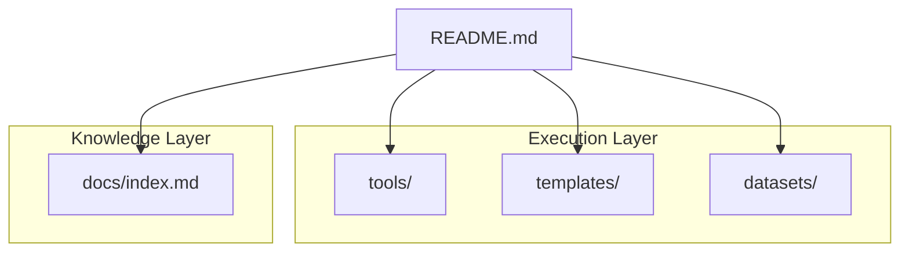
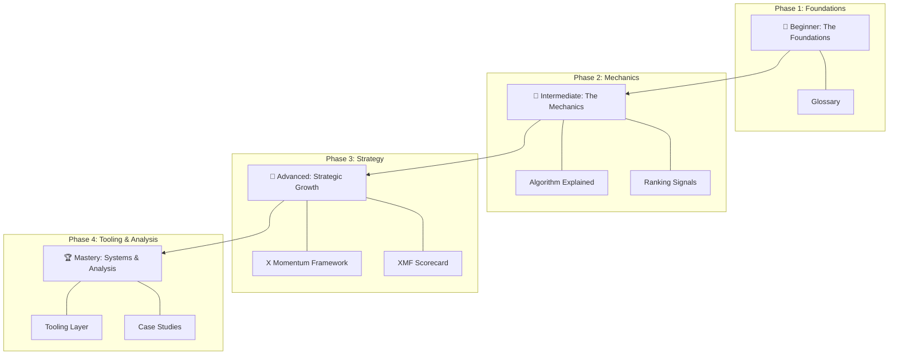

# X Growth Lab 🧪

**The most useful open-source resource for understanding content distribution, recommendation systems, and creator growth on X.**

---

## 🚀 Why This Repository Exists
Most "growth hacks" are temporary, unsupported, or spammy. The platform is not a lottery; it is a complex **Recommendation System**.

X Growth Lab exists to demystify the mechanics of the "For You" feed and provide creators, founders, and developers with a systems-based approach to growth. We bridge the gap between technical platform engineering and practical creator workflows.

## 🛠 The Tooling Layer (New!)
Turn theory into action with our local-first command-line tools.
- **[X Momentum Assessor](tools/README.md#1-x-momentum-assessor-x-momentum-assessorpy):** Diagnose your account's health.
- **[Post Analyzer](tools/README.md#2-post-analyzer-post-analyzerpy):** Improve your drafts before publishing.
- **[Hook Generator](tools/README.md#3-hook-generator-hook-generatorpy):** Generate high-conversion hooks.
- **See all tools in the [Tools Directory](tools/).**

## ✨ The X Momentum Framework (XMF)
Our signature methodology for growth. The XMF is an operational system that moves from **Assessment** to **Action**:

1.  **[The X Momentum Framework](docs/x-momentum-framework.md):** Understand the 5 pillars of the system.
2.  **[XMF Scorecard](templates/x-momentum-scorecard.md):** Take the assessment to find your momentum score (0-100).
3.  **[XMF Action Planner](docs/xmf-action-planner.md):** Get targeted recommendations based on your score.

---

## 👥 Who This Is For
- **Beginners:** Learn the "rules of the game" from scratch.
- **Creators:** Transition from "random posting" to a sustainable engine.
- **Founders/Indie Hackers:** Build authority and distribution for your products.
- **Marketers:** Understand the technical ranking signals that drive reach.

## 🏗 Repository Architecture

## 🗺 Learning Roadmap
Follow this visual progression to master the platform:

## 🧠 Key Concepts Covered
| Concept | Description | Resource |
| :--- | :--- | :--- |
| **XMF Score** | A weighted formula to measure post momentum. | [XMF Scorecard](templates/x-momentum-scorecard.md) |
| **Heavy Ranker** | The neural network scoring candidate posts. | [Algorithm](docs/algorithm-explained.md) |
| **Signal Weights** | The hierarchy of Bookmarks, Replies, and Likes. | [Ranking](docs/ranking-signals.md) |
| **3-Pillar Strategy** | Balancing Value, Authority, and Personality. | [Strategies](docs/growth-strategies.md) |
| **Daily Workflow** | The "20-5-10-15" routine for consistency. | [Playbook](docs/creator-playbook.md) |

## 🎯 Example Learning Outcomes
By the end of this curriculum, you will be able to:
1. **Analyze your analytics** to identify high-signal content.
2. **Calculate your Momentum Score** using the **X Momentum Assessor**.
3. **Design hooks** that significantly increase "Out-of-Network" reach.
4. **Build a daily routine** that ensures growth without burnout.

## 🤝 Contributing
We love contributions! See **[CONTRIBUTING.md](CONTRIBUTING.md)** for our standards and how to get involved.

---

Built with ❤️ by the community.
