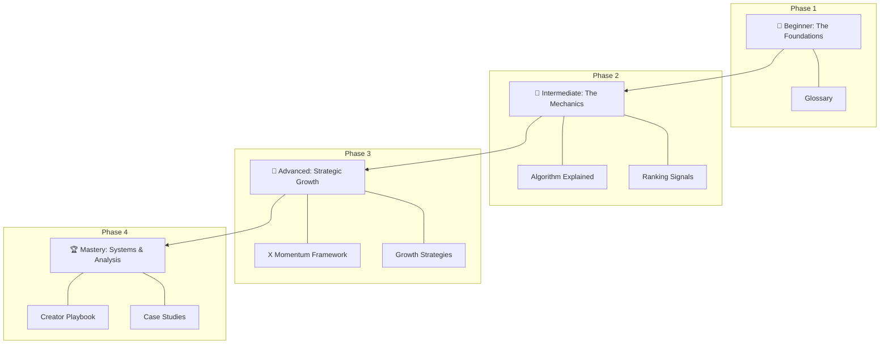
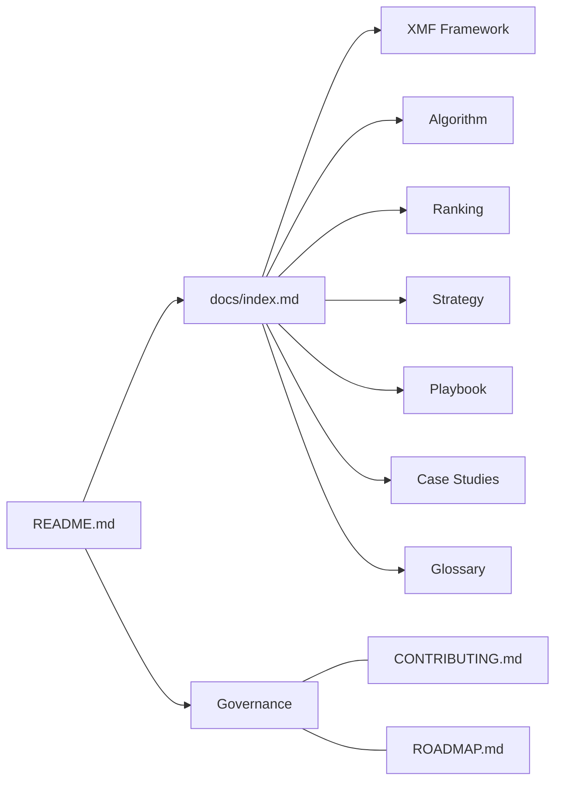

# X Growth Lab 🧪

**The most useful open-source resource for understanding content distribution, recommendation systems, and creator growth on X.**

---

## 🚀 Why This Repository Exists
Most "growth hacks" are temporary, unsupported, or spammy. The platform is not a lottery; it is a complex **Recommendation System**.

X Growth Lab exists to demystify the mechanics of the "For You" feed and provide creators, founders, and developers with a systems-based approach to growth. We bridge the gap between technical platform engineering and practical creator workflows.

## ✨ The X Momentum Framework (XMF)
Our signature methodology for growth. The XMF treats your presence as a system of compounding energy:
1. **Signal Generation:** Creating high-weight interactions.
2. **Algorithmic Velocity:** Maximizing initial engagement speed.
3. **Out-of-Network Expansion:** Breaking into new audiences.
4. **Profile Conversion:** Turning reach into followers.
5. **Community Retention:** Building an active inner circle.

Read the full guide: **[The X Momentum Framework (XMF)](docs/x-momentum-framework.md)**.

---

## 👥 Who This Is For
- **Beginners:** Learn the "rules of the game" from scratch.
- **Creators:** Transition from "random posting" to a sustainable engine.
- **Founders/Indie Hackers:** Build authority and distribution for your products.
- **Marketers:** Understand the technical ranking signals that drive reach.
- **AI Builders:** Study the large-scale recommendation pipelines that power modern social apps.

## 🗺 Learning Roadmap
Follow this visual progression to master the platform:

## 🧠 Key Concepts Covered
| Concept | Description | Document |
| :--- | :--- | :--- |
| **XMF Score** | A weighted formula to measure post momentum. | [XMF Guide](docs/x-momentum-framework.md) |
| **Heavy Ranker** | The neural network scoring candidate posts. | [Algorithm](docs/algorithm-explained.md) |
| **Signal Weights** | The hierarchy of Bookmarks, Replies, and Likes. | [Ranking](docs/ranking-signals.md) |
| **3-Pillar Strategy** | Balancing Value, Authority, and Personality. | [Strategies](docs/growth-strategies.md) |
| **Daily Workflow** | The "20-5-10-15" routine for consistency. | [Playbook](docs/creator-playbook.md) |

## 🏗 Repository Architecture

## 🎯 Example Learning Outcomes
By the end of this curriculum, you will be able to:
1. **Analyze your analytics** to identify high-signal content.
2. **Calculate your Momentum Score** to audit post performance.
3. **Design hooks** that significantly increase "Out-of-Network" reach.
4. **Build a daily routine** that ensures growth without burnout.

## ✨ What Makes This Different?
- **The X Momentum Framework:** A unique, systems-first methodology.
- **Educational First:** Every guide includes exercises and "beginner mistakes" to avoid.
- **Open & Evolving:** This isn't a static PDF; it's a living, community-driven project.

## ⏱ Quick Start
1. **Star this repository** to track updates.
2. Visit the **[Learning Hub (docs/index.md)](docs/index.md)**.
3. Start with the **[X Momentum Framework](docs/x-momentum-framework.md)** (4 min read).

## 🤝 Contributing
We love contributions! See **[CONTRIBUTING.md](CONTRIBUTING.md)** for our standards and how to get involved.

---

Built with ❤️ by the community.
