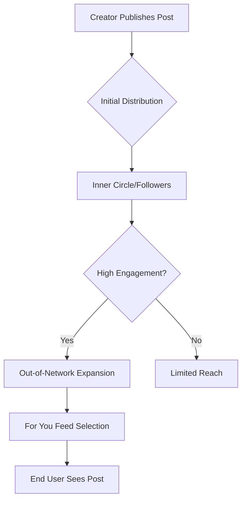

# Algorithm Explained

## Introduction
The X algorithm is a complex set of rules and machine learning models that determine which posts appear in a user's "For You" timeline. Its primary goal is to maximize user satisfaction and platform retention by showing content that is most relevant and engaging to each individual.

## Core Concepts
### The Timeline Split
- **Following:** A chronological feed of posts from people you follow.
- **For You:** An algorithmically curated feed that includes posts from people you follow and people you don't (Out-of-Network).

### The Heavy Ranker
At the heart of the algorithm is the "Heavy Ranker," a neural network with billions of parameters that scores thousands of candidate posts in real-time to predict the likelihood of you engaging with them.

## Content Distribution
The following diagram illustrates how a post travels from a creator to a user's feed:

## Examples
- **The Viral Loop:** A post gets immediate replies and bookmarks from followers. The algorithm sees this as high quality and pushes it to a wider audience with similar interests.
- **The Ghosted Post:** A post with no engagement in the first 30 minutes. The algorithm deprioritizes it, and it rarely leaves the "Following" feed.

## Practical Takeaways
1. **The First Hour Matters:** Early engagement is a strong signal for wider distribution.
2. **Relevance is Key:** The algorithm tries to match content with interested users. Don't be too broad.
3. **Quality > Quantity:** High-engagement posts are rewarded more than frequent low-quality posts.

## Further Reading
- [Ranking Signals](ranking-signals.md)
- [Growth Strategies](growth-strategies.md)
- [Glossary](glossary.md)
