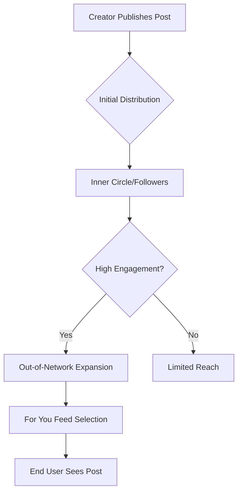

# Algorithm Explained

## Introduction
The X algorithm is a complex set of rules and machine learning models that determine which posts appear in a user's "For You" timeline. Its primary goal is to maximize user satisfaction and platform retention by showing content that is most relevant and engaging to each individual.

## Core Concepts
### 1. The Timeline Split
- **Following:** A chronological feed of posts from people you follow.
- **For You:** An algorithmically curated feed that includes posts from people you follow and people you don't (Out-of-Network).

### 2. The Heavy Ranker
At the heart of the algorithm is the "Heavy Ranker," a neural network with billions of parameters that scores thousands of candidate posts in real-time to predict the likelihood of you engaging with them.

> **Why it matters:** Understanding that your content competes with thousands of other posts in a split second helps you realize why "hooks" and immediate value are critical.

## Content Distribution
The following diagram illustrates how a post travels from a creator to a user's feed:

## Common Beginner Mistakes
- **Shadowban Paranoia:** Most "visibility drops" are due to low engagement, not a secret ban.
- **Engagement Pods:** Artificially boosting posts can confuse the algorithm's understanding of who your real audience is.
- **Posting Too Much:** Flooding the feed can lead to "follower fatigue" and lower per-post engagement.

## Practical Applications
- **Test Hooks:** Since the algorithm rewards initial interest, spend 80% of your time on the first line of your post.
- **Analyze Peaks:** Check your analytics to see when your audience is most active and schedule your "heavy hitters" for those times.

## Mini Exercise
Open your "For You" feed right now. Look at the first 5 posts from people you *don't* follow. For each one, identify:
1. Why do you think the algorithm showed this to you? (Shared interests? High engagement?)
2. What was the "hook" that caught your eye?

## Summary
The algorithm is an matching engine. It wants to find the best content for the user, not just the best user for the content. By focusing on high-quality, relevant interactions, you make the algorithm work for you.

---

### 💡 Key Takeaways
- **The First Hour Matters:** Early engagement is a strong signal for wider distribution.
- **Relevance is Key:** The algorithm tries to match content with interested users. Don't be too broad.
- **Quality > Quantity:** High-engagement posts are rewarded more than frequent low-quality posts.

## Related Reading
- [Ranking Signals](ranking-signals.md)
- [Growth Strategies](growth-strategies.md)
- [Glossary](glossary.md)
