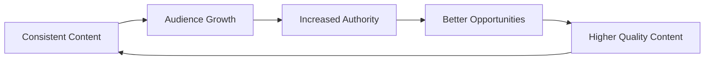

# Creator Playbook

## Introduction
The Creator Playbook is a set of actionable workflows and routines designed to help you maintain consistency and maximize your growth potential on X.

## Core Concepts
### 1. The Daily Routine (30-60 Minutes)
1. **Engage (20 mins):** Reply to 5-10 large accounts in your niche and 5-10 peers.
2. **Post (5 mins):** Publish your scheduled value post or a timely observation.
3. **Connect (10 mins):** Answer all your mentions and DMs.
4. **Learn (15 mins):** Read 3-5 high-performing threads in your niche to study their structure.

### 2. The Weekly Routine
- **Review Analytics:** Identify your top 3 posts and analyze why they worked.
- **Batch Create:** Write 5-7 posts for the upcoming week.
- **Network:** Reach out to one potential collaborator for a quote-tweet swap or partnership.

> **Why it matters:** Success on X is a marathon, not a sprint. Systems reduce the cognitive load of "what should I do today?" and ensure you're doing the high-impact work.

## Creator Growth Flywheel
Sustainable growth comes from a compounding loop of content and connection:

## Common Beginner Mistakes
- **Burnout:** Trying to post 5 times a day from day one.
- **Ghosting Followers:** Not replying to your own comments makes you look unapproachable.
- **Low-Quality Replies:** "Great post!" or "Agree" doesn't add value and won't get you noticed.

## Practical Applications
- **The "20-5-10-15" Rule:** If you're short on time, prioritize the Daily Routine in that exact order.
- **Schedule Your Posts:** Use tools (or the built-in scheduler) to maintain consistency without being glued to your phone.

## Mini Exercise
Commit to the "Daily Routine" for the next 3 days. Track your notifications each day. Do you see an increase in "Profile Visits" or "New Followers"?

## Summary
The best creators aren't just talented; they are disciplined. By treating your presence as a system with defined inputs and routines, you remove the guesswork and build a foundation for exponential growth.

---

### 💡 Key Takeaways
- **Systems > Willpower:** Don't rely on inspiration; follow a schedule.
- **Focus on Input:** You can't control the algorithm, but you can control how many high-quality replies you write.
- **Iterate Constantly:** Your strategy should evolve as your audience grows.

## Related Reading
- [Growth Strategies](growth-strategies.md)
- [Ranking Signals](ranking-signals.md)
- [Glossary](glossary.md)
