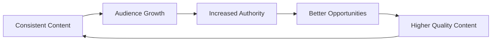

# Creator Playbook

## Introduction
The Creator Playbook is a set of actionable workflows and routines designed to help you maintain consistency and maximize your growth potential on X.

## Core Concepts
### The Daily Routine (30-60 Minutes)
1. **Engage (20 mins):** Reply to 5-10 large accounts in your niche and 5-10 peers.
2. **Post (5 mins):** Publish your scheduled value post or a timely observation.
3. **Connect (10 mins):** Answer all your mentions and DMs.
4. **Learn (15 mins):** Read 3-5 high-performing threads in your niche to study their structure.

### The Weekly Routine
- **Review Analytics:** Identify your top 3 posts and analyze why they worked.
- **Batch Create:** Write 5-7 posts for the upcoming week.
- **Network:** Reach out to one potential collaborator for a quote-tweet swap or partnership.

## Creator Growth Flywheel
Sustainable growth comes from a compounding loop of content and connection:

## Examples
- **The "Thread a Week" Strategy:** Dedicate Sunday to writing one deep-dive thread that showcases your expertise.
- **The "Reply First" Strategy:** Spend 30 minutes a day replying before you even think about posting your own content.

## Practical Takeaways
- **Systems > Willpower:** Don't rely on inspiration; follow a schedule.
- **Focus on Input:** You can't control the algorithm, but you can control how many high-quality replies you write.
- **Iterate Constantly:** Your strategy should evolve as your audience grows.

## Further Reading
- [Growth Strategies](growth-strategies.md)
- [Ranking Signals](ranking-signals.md)
- [Glossary](glossary.md)
