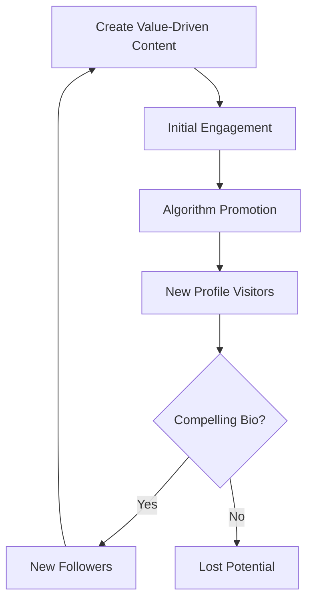

# Growth Strategies

## Introduction
Growth on X is not about "hacking" the system; it's about building a sustainable engine that provides value to a specific audience. This document outlines the core frameworks for building that engine.

## Core Concepts
### The 3-Pillar Strategy
1. **Value:** Educational or informative content that solves a problem.
2. **Authority:** Demonstrating expertise in a specific niche.
3. **Personality:** Building a human connection through stories and opinions.

### The Hook-Body-CTAFramework
Every post or thread should follow this structure to maximize retention and engagement.

## Engagement Loop
Engagement creates a virtuous cycle that leads to more visibility and followers:

## Examples
- **Educational Threads:** "10 ways to use [Tool] to save 5 hours a week."
- **Contrarian Takes:** Challenging common wisdom to spark discussion.
- **Building in Public:** Sharing the journey, including failures and wins.

## Practical Takeaways
- **Find Your Niche:** It's easier to grow when you're the "go-to" person for a specific topic.
- **Optimize Your Profile:** Your bio and pinned post are your landing page.
- **Engage with Others:** Growth doesn't happen in a vacuum. Reply to larger accounts in your niche.

## Further Reading
- [Creator Playbook](creator-playbook.md)
- [Case Studies](case-studies.md)
- [Algorithm Explained](algorithm-explained.md)
