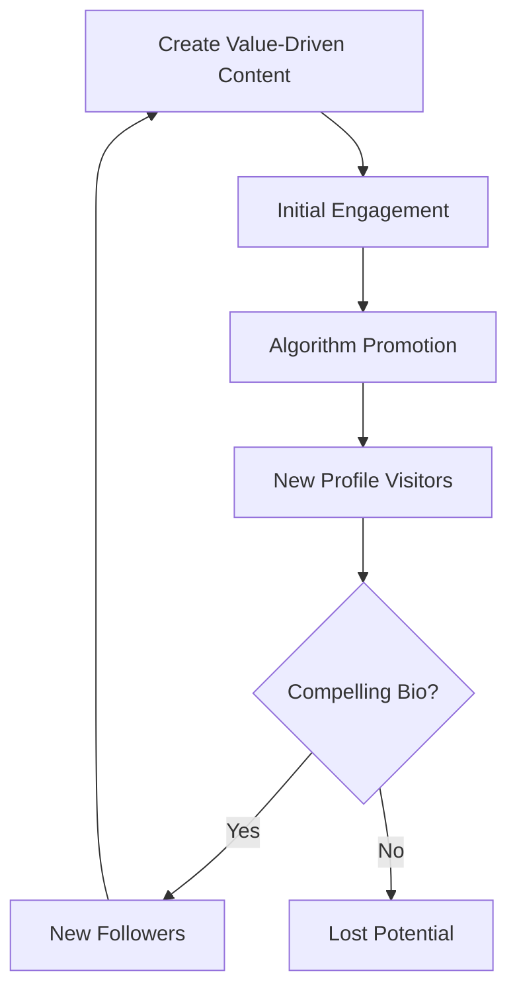

# Growth Strategies

## Introduction
Growth on X is not about "hacking" the system; it's about building a sustainable engine that provides value to a specific audience. This document outlines the core frameworks for building that engine.

## Core Concepts
### 1. The 3-Pillar Strategy
1. **Value:** Educational or informative content that solves a problem.
2. **Authority:** Demonstrating expertise in a specific niche.
3. **Personality:** Building a human connection through stories and opinions.

### 2. The Hook-Body-CTA Framework
Every post or thread should follow this structure to maximize retention and engagement.

> **Why it matters:** Consistency in structure makes your content predictable and reliable for your followers, while also feeding the algorithm the signals it needs.

## Engagement Loop
Engagement creates a virtuous cycle that leads to more visibility and followers:

## Common Beginner Mistakes
- **No Niche:** Trying to talk to everyone means talking to no one.
- **Self-Promotion Overload:** If every post is an ad for your product, people will stop engaging.
- **Ignoring the "Social" in Social Media:** Only posting and never replying to others.

## Practical Applications
- **The 80/20 Rule:** 80% value/education, 20% promotion/personality.
- **Profile as a Landing Page:** Ensure your pinned post is your best "Value" post.

## Mini Exercise
Write a 3-post "Value" thread about a topic you know well. Use the Hook-Body-CTA framework:
- **Hook:** A bold claim or a promise of a solution.
- **Body:** 3-5 bullet points of actionable info.
- **CTA:** Ask for a specific reply or a bookmark.

## Summary
Growth is a byproduct of value. By focusing on building authority in a niche and connecting with others, you create a flywheel that the algorithm will naturally amplify.

---

### 💡 Key Takeaways
- **Find Your Niche:** It's easier to grow when you're the "go-to" person for a specific topic.
- **Optimize Your Profile:** Your bio and pinned post are your landing page.
- **Engage with Others:** Growth doesn't happen in a vacuum. Reply to larger accounts in your niche.

## Related Reading
- [Creator Playbook](creator-playbook.md)
- [Case Studies](case-studies.md)
- [Algorithm Explained](algorithm-explained.md)
