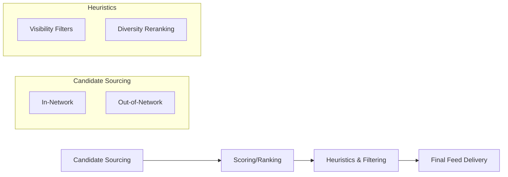

# Ranking Signals

## Introduction
Not all engagements are created equal. The X algorithm assigns different "weights" to various ways users interact with your content. Understanding these signals is crucial for optimizing your growth.

## Core Concepts
While the exact weights change frequently, the hierarchy generally follows this pattern of importance:

1. **Bookmarks:** High signal of "save for later" or high value.
2. **Replies:** Indicates conversation and time spent.
3. **Retweets/Quotes:** Signal of endorsement and sharing.
4. **Likes:** A basic signal of appreciation.
5. **Views/Clicks:** The baseline signal of interest.

## Recommendation Pipeline
X uses a multi-stage pipeline to select the best posts for your "For You" feed:

## Examples
- **Signal Stacking:** A post that gets 10 bookmarks and 5 replies will often outrank a post with 100 likes but no other interaction.
- **Negative Signals:** Reporting a post, blocking a user, or clicking "Not interested" significantly reduces the visibility of similar content.

## Practical Takeaways
- **Encourage Saves:** Create "resource" style content that users want to bookmark.
- **Start Conversations:** Ask questions to encourage replies.
- **Avoid "Engagement Bait":** The algorithm can penalize low-quality tactics that don't lead to genuine engagement.

## Further Reading
- [Algorithm Explained](algorithm-explained.md)
- [Creator Playbook](creator-playbook.md)
- [Glossary](glossary.md)
