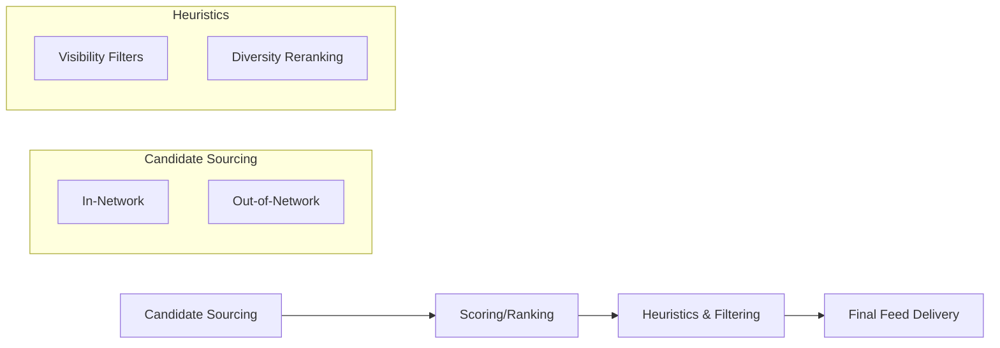

# Ranking Signals

## Introduction
Not all engagements are created equal. The X algorithm assigns different "weights" to various ways users interact with your content. Understanding these signals is crucial for optimizing your growth.

## Core Concepts
While the exact weights change frequently, the hierarchy generally follows this pattern of importance:

1. **Bookmarks:** High signal of "save for later" or high value.
2. **Replies:** Indicates conversation and time spent.
3. **Retweets/Quotes:** Signal of endorsement and sharing.
4. **Likes:** A basic signal of appreciation.
5. **Views/Clicks:** The baseline signal of interest.

> **Why it matters:** If you only optimize for "Likes," you might be missing out on the deeper signals (Bookmarks/Replies) that the algorithm uses to push content to "Out-of-Network" users.

## Recommendation Pipeline
X uses a multi-stage pipeline to select the best posts for your "For You" feed:

## Common Beginner Mistakes
- **Ignoring Replies:** Not replying to your own comments kills the "conversation" signal.
- **Weak CTA:** Not giving users a reason to bookmark or reply.
- **Clickbait:** High clicks with low time-spent or high bounce rates can eventually penalize your reach.

## Practical Applications
- **Create "Saveable" Content:** Lists, tutorials, and deep-dives naturally encourage bookmarks.
- **Ask Open Questions:** Instead of "Do you like this?", try "How would you apply this to your workflow?" to spark longer replies.

## Mini Exercise
Pick your last 3 posts. Which one had the highest **Bookmark-to-View** ratio? Analyze what made that specific post more "saveable" than the others.

## Summary
Ranking is a calculation of probability. Every signal increases the probability that your post is exactly what the next user wants to see. Diversify your "engagement portfolio" to maximize reach.

---

### 💡 Key Takeaways
- **Encourage Saves:** Create "resource" style content that users want to bookmark.
- **Start Conversations:** Ask questions to encourage replies.
- **Avoid "Engagement Bait":** The algorithm can penalize low-quality tactics that don't lead to genuine engagement.

## Related Reading
- [Algorithm Explained](algorithm-explained.md)
- [Creator Playbook](creator-playbook.md)
- [Glossary](glossary.md)
