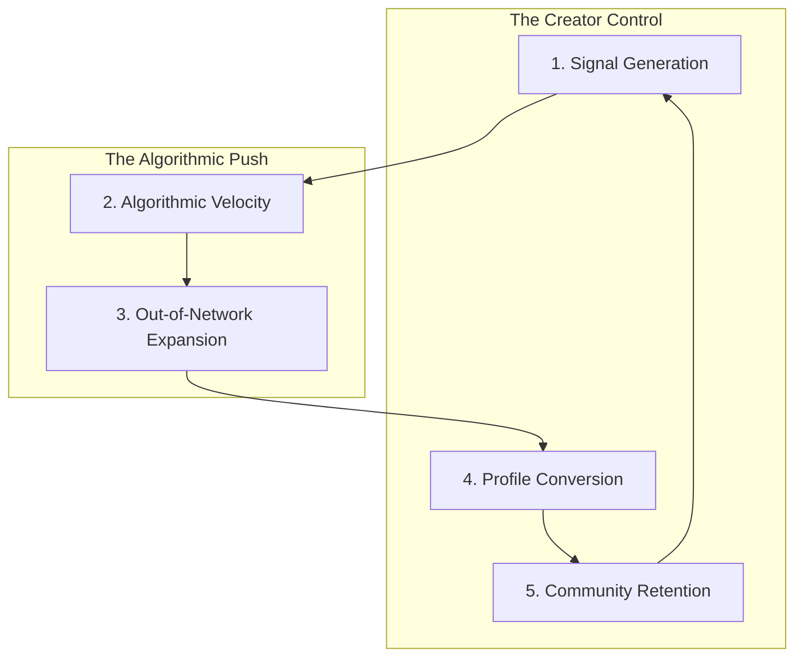

# The X Momentum Framework (XMF)

## Introduction
The **X Momentum Framework (XMF)** is the signature methodology developed by X Growth Lab. It is designed to move beyond "growth hacks" by treating your presence on X as a thermodynamic system: high energy inputs (high-quality signals) lead to increased velocity (algorithmic reach), which eventually creates a self-sustaining orbit (community retention).

## Core Concepts
The XMF is built on five compounding pillars:

### 1. Signal Generation (Input)
Everything starts with the quality of the interaction.
- **Goal:** To create "High-Weight" interactions (Bookmarks, Replies) rather than just "Low-Weight" ones (Likes, Views).
- **Why it matters:** The algorithm uses initial signal weight to determine if a post is worthy of wider distribution.

### 2. Algorithmic Velocity (Acceleration)
The speed at which signals are accumulated in the first 60 minutes.
- **Goal:** To condense engagement into a short window.
- **Why it matters:** High velocity triggers the "Heavy Ranker" to prioritize your post in the "For You" feed.

### 3. Out-of-Network Expansion (Reach)
Breaking out of your follower bubble.
- **Goal:** To maximize appearances in the "For You" feeds of people who *don't* follow you.
- **Why it matters:** True growth is impossible without reaching new audiences through algorithmic recommendation.

### 4. Profile Conversion (Efficiency)
Turning impressions into followers.
- **Goal:** High conversion rate from "Profile Visit" to "Follow."
- **Why it matters:** Huge reach is wasted if your profile doesn't communicate immediate value to new visitors.

### 5. Community Retention (Stability)
Turning followers into an "Inner Circle."
- **Goal:** To ensure your followers consistently engage with your new content.
- **Why it matters:** A loyal inner circle provides the "Initial Distribution" required to restart the flywheel for every new post.

## Visual Framework
The X Momentum Flywheel:

## Common Beginner Mistakes
- **Ignoring the Control Pillars:** Spending all day worrying about the algorithm (2 & 3) while neglecting your content quality (1) or your profile bio (4).
- **Low Signal Weight:** Posting content that is easy to like but hard to bookmark or reply to.
- **The "Dead Follower" Trap:** Buying followers or using pods, which creates 0 community retention and kills future signal generation.

## Practical Applications
- **Signal Audit:** Look at your last 10 posts. How many offered enough value to be bookmarked?
- **Conversion Check:** For every 100 profile visits, how many new followers do you get? (Target: >5%).
- **Velocity Routine:** Schedule your posts for when you are active so you can respond to replies immediately to boost velocity.

## Mini Exercise
Calculate your **X Momentum Score** for your most recent post:
- **(Bookmarks * 10) + (Replies * 5) + (Retweets * 3) + (Likes * 1) = Total Signal Score.**
- Now, divide that by the number of hours the post has been live to get your **Velocity Score.**
- How does this compare to your average?

## Summary
The X Momentum Framework treats growth as a holistic system. You cannot have sustainable reach without high-quality signals, and you cannot have a sustainable audience without efficient profile conversion and retention.

---

### 💡 Key Takeaways
- **Focus on the Inputs:** You control Signal Generation, Profile Conversion, and Retention. The algorithm controls Velocity and Expansion.
- **Condensed Engagement:** The first hour is the most critical for triggering the expansion phase.
- **Conversion > Reach:** It is better to have 1,000 views and 50 followers than 100,000 views and 5 followers.

## Related Reading
- [Algorithm Explained](algorithm-explained.md)
- [Ranking Signals](ranking-signals.md)
- [Growth Strategies](growth-strategies.md)
