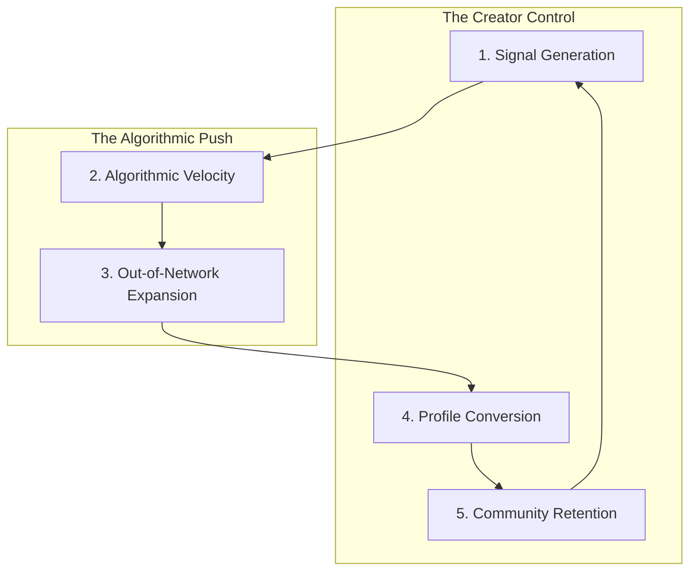

# 🚀 The X Momentum Framework (XMF)

## Introduction
The **X Momentum Framework** is the foundational methodology of the X Growth Lab. It moves away from "chasing the algorithm" and toward building a self-sustaining content engine. By understanding the 5 pillars of momentum, you can diagnose exactly why an account is stalled and how to restart its audience growth and authority.

---

## The 5 Pillars of Momentum

### 1. Signal Generation (Input)
*Definition: The ability to generate high-value interactions.*
- **Metric:** Bookmark-to-Like ratio and Reply-to-View ratio.
- **Why it matters:** These signals tell the "Heavy Ranker" that your content has deep utility or sparks genuine conversation.

### 2. Algorithmic Velocity (Process)
*Definition: The speed of signal accumulation in the first 60 minutes.*
- **Metric:** Engagement acceleration rate (Total Signals / Time).
- **Why it matters:** High velocity triggers the expansion phase by prioritizing your post in the "For You" feed.

### 3. Out-of-Network Expansion (Process)
*Definition: Breaking out of your existing follower base.*
- **Metric:** Non-follower reach percentage.
- **Why it matters:** Sustainable growth requires reaching "New-to-You" users who are likely to convert.

### 4. Profile Conversion (Action)
*Definition: Turning impressions into followers.*
- **Metric:** Follow-to-Profile-Visit ratio.
- **Why it matters:** Reach is a vanity metric if your profile doesn't communicate enough value to trigger a follow.

### 5. Community Retention (Outcome/Stability)
*Definition: Building a loyal "Inner Circle."*
- **Metric:** Recurring engagement rate from existing followers.
- **Why it matters:** A strong retention layer provides the "seed" engagement for future posts, restarting the flywheel.

---

## Visual Framework
The X Momentum Flywheel:

## Common Beginner Mistakes
- **Ignoring the Control Pillars:** Obsessing over the algorithm (2 & 3) while neglecting content quality (1) or profile optimization (4).
- **Low Signal Weight:** Optimizing for "Likes" (low weight) instead of "Bookmarks" (high weight).

## Practical Applications
- **Audit Your State:** Use the **[X Momentum Assessor](../tools/README.md#1-x-momentum-assessor-x-momentum-assessorpy)** tool to find your current momentum tier.
- **Apply Corrections:** Use the **[XMF Action Planner](xmf-action-planner.md)** to fix your lowest-scoring pillar.

## Mini Exercise
Pick your most recent post and categorize its primary signal. Was it designed to be **Bookmarked** (Utility), **Replied to** (Conversation), or **Liked** (Appreciation)? Use the **[Post Analyzer](../tools/post-analyzer.py)** to see how you can improve it.

## Summary
The X Momentum Framework is a diagnostic and operational tool. Use it to stop guessing and start measuring the specific mechanics that drive growth.

---

### 💡 Key Takeaways
- **Inputs Drive Everything:** You cannot have velocity or expansion without high-weight signals.
- **Conversion > Reach:** A smaller, high-conversion account will eventually outgrow a larger, low-conversion account.
- **Routines Matter:** Use the [Creator Playbook](creator-playbook.md) to maintain the "Community Retention" pillar.

## Related Reading
- [XMF Scorecard](../templates/x-momentum-scorecard.md)
- [XMF Action Planner](xmf-action-planner.md)
- [Tooling Layer](../tools/README.md)
